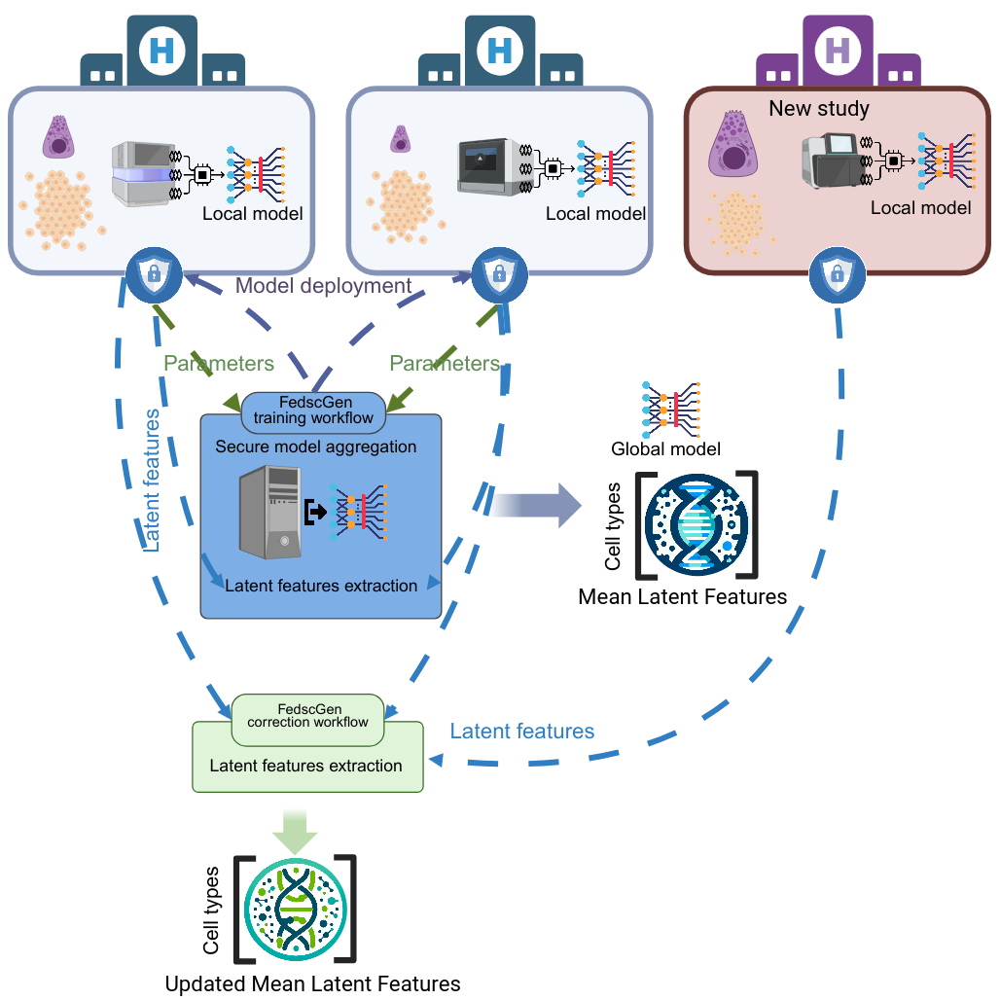

# FedscGen: privacy-preserving federated batch effect correction of single-cell RNA sequencing data

FedscGen is a federated learning framework for privacy-aware batch effect correction in single-cell RNA sequencing (scRNA-seq) data. It enables multiple institutions to collaboratively train a shared variational autoencoder (VAE) model without exchanging raw data. Each site trains a local model and securely shares only model parameters with a central coordinator, which aggregates them to update the global model. After training, the shared model is used to extract latent representations of cells across sites. For each shared cell type, dominant batches are identified, and corresponding mean latent features are calculated and aggregated in a privacy-preserving manner. These latent shifts are then used to locally correct batch effects, allowing new or existing clients to harmonize their datasets while maintaining full control over their data.

<div align="center">
  
</div>


## 🔧 Setup Environment

To reproduce the results of the paper, please follow the instructions to create two Conda environments:
1. `fedscgen`: Python environment for FedscGen.
2. `r_eval`: R + Python environment for benchmarking.

### Set up a Python environment for FedscGen:
```shell
conda env create -f environment.yml
conda activate fedscgen
export SKLEARN_ALLOW_DEPRECATED_SKLEARN_PACKAGE_INSTALL=True
pip install crypten==0.4.1
```
### Set up an R environment for running kBET and LISI for evaluation:
```shell
conda env create -f r_eval.yml
conda activate r_eval
Rscript install_libraries.R
```


## Dataset and Models
For reproducibility, please ensure the preprocessed datasets are downloaded and extracted to the [`data/datasets`](data/datasets) directory. Optionally, the initial models can also be downloaded to the [`models/`](models) directory.

* The initial PyTorch models are available at <a href="https://doi.org/10.5281/zenodo.11505054"></a>

* All preprocessed datasets used in the paper are available at <a href="https://doi.org/10.5281/zenodo.11489844"></a>

## 📊 Reproduce Results
All models are initialized using a fixed seed for reproducibility.

Navigate to the [`experiments/`](experiments) directory and run [`experiments.sh`](experiments/experiment.sh)
while providing a comma-separated list of GPU indices to use for training. For example, to use GPUs 0 and 1:

```shell
conda activate fedscgen
cd experiments
chmod +x experiment.sh
./experiment.sh 0,1
```

Once the experiments are complete, run the evaluation metrics by navigating to the [`metrics/`](metrics) directory and executing [`evaluate.sh`](metrics/evaluate.sh):
```shell
conda activate r_eval
cd metrics
chmod +x evaluation.sh
./evaluation.sh
```
All results will be saved in the [`results/`](results) directory. Both scripts will automatically fully utilize the available system resources.

## <a href="https://featurecloud.ai/app/fedscgen" target="_blank">  </a> app
FedscGen is implemented for real-world federated collaboration as a FeatureCloud app with automated deployment.

* Explore the app: [FedscGen App on FeatureCloud](https://featurecloud.ai/app/fedscgen)
* Source code: [fc-fedscgen GitHub Repository](https://github.com/Mohammad-Bakhtiari/fc-fedscgen)

## License
This project is licensed under the Apache License 2.0 - see the [LICENSE](LICENSE) file for details.
